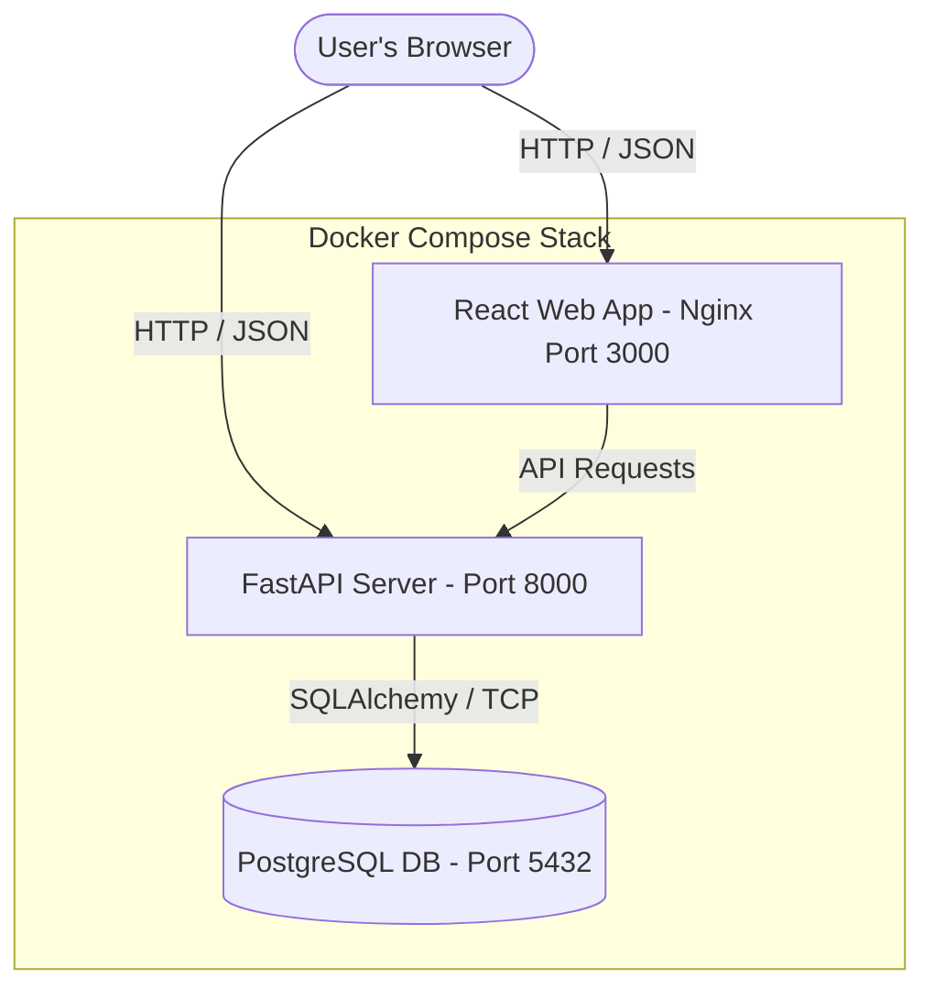
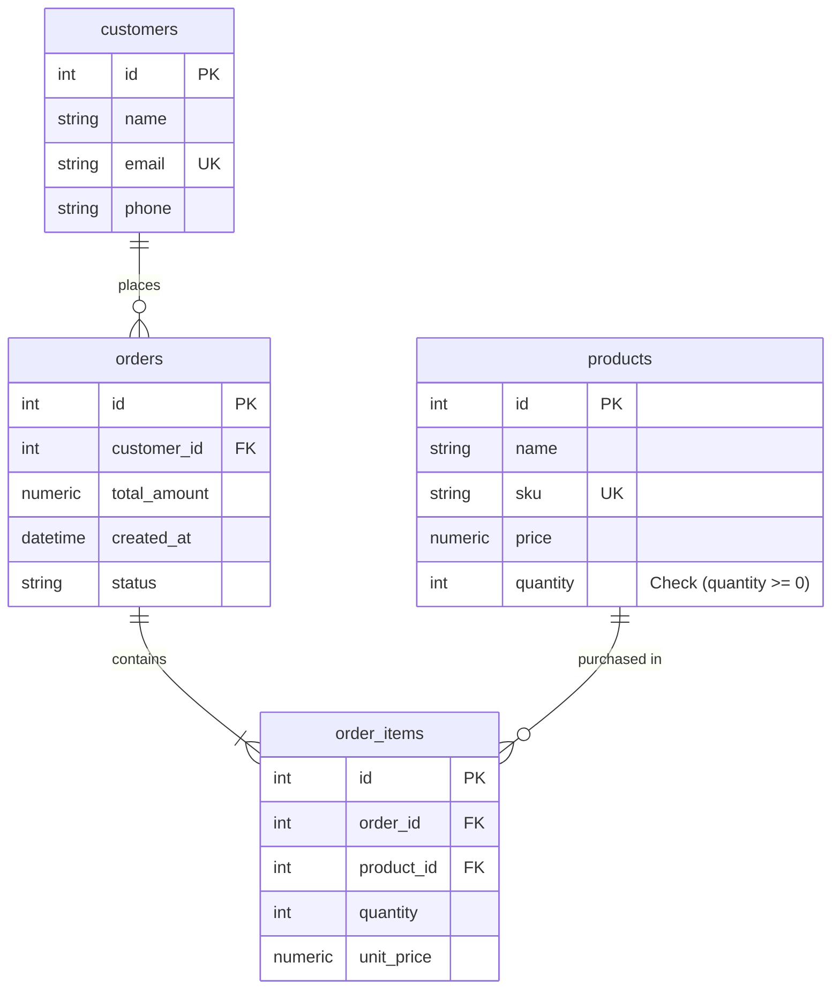

# Production-Ready Containerized Inventory & Order Management System

A full-stack, containerized Inventory & Order Management System. The application consists of a **FastAPI (Python) backend**, a **React frontend** styled with a custom vanilla CSS design system, and a **PostgreSQL database**. The entire stack is containerized using **Docker** and orchestrated with **Docker Compose**.

---

## 1. System Architecture

Below is the design overview illustrating how the components communicate:



---

## 2. Technology Stack & Features

- **Backend**: Python 3.11, FastAPI (structured, auto-documented via Swagger at `/docs`), SQLAlchemy ORM, and Pydantic validation.
- **Frontend**: React 19 (via Vite), Lucide React (premium SVG icons), and a responsive Vanilla CSS design system matching modern dark/light system choices.
- **Database**: PostgreSQL 15, persisted via named Docker volumes.
- **Orchestration**: Docker Compose with database readiness checks.

---

## 3. Database Schema Design

The PostgreSQL database contains 4 key tables linked together with appropriate constraints:



---

## 4. API Endpoints Reference

### Dashboard Summary
- `GET /dashboard/summary`: Retrieves counts for products, customers, and orders, along with a list of products under the low stock threshold (`quantity < 10`).

### Product Catalog
- `POST /products`: Add a new product (validates SKU uniqueness, positive price, non-negative quantity).
- `GET /products`: List all products.
- `GET /products/{id}`: Get product details by ID.
- `PUT /products/{id}`: Update product fields (validates SKU constraints).
- `DELETE /products/{id}`: Delete a product (raises a `400` error if it is referenced in an existing order to protect database integrity).

### Customer Directory
- `POST /customers`: Register a new customer (validates email format and uniqueness).
- `GET /customers`: List all customers.
- `GET /customers/{id}`: Get customer by ID.
- `DELETE /customers/{id}`: Remove a customer (cascade-deletes their orders).

### Orders & Checkout
- `POST /orders`: Place a new order with multiple items. 
  - *Business Logic*: Verifies customer and product existence, check stock availability, decrements stock, calculates the total amount automatically on the backend, and inserts records as a single atomic database transaction.
- `GET /orders`: List all orders with client details and invoice list.
- `GET /orders/{id}`: Get detailed order info by ID.
- `DELETE /orders/{id}`: Cancels and deletes the order. 
  - *Business Logic*: Restocks the items automatically (increments product stock in database transaction) and deletes the invoice.

---

## 5. Local Setup Instructions

### 5.1 Prerequisites
- Python 3.10+ installed
- Node.js 18+ and npm installed
- PostgreSQL running locally (or sqlite fallback)

### 5.2 Running the Backend (using uv)
1. Move to the backend folder:
   ```bash
   cd backend
   ```
2. Create and activate a virtual environment using `uv`:
   ```bash
   # Create the environment
   uv venv
   
   # Activate it (Linux/macOS)
   source .venv/bin/activate
   
   # Or activate it (Windows)
   .venv\Scripts\activate
   ```
3. Install dependencies:
   ```bash
   uv pip install -r requirements.txt
   ```
4. Run the FastAPI development server:
   ```bash
   uv run uvicorn app.main:app --reload --host 0.0.0.0 --port 8000
   ```
5. View API docs at: `http://localhost:8000/docs`.

### 5.3 Running the Frontend
1. Move to the frontend folder:
   ```bash
   cd frontend
   ```
2. Install dependencies:
   ```bash
   npm install
   ```
3. Run the Vite development server:
   ```bash
   npm run dev
   ```
4. Access the web dashboard at: `http://localhost:5173`.

---

## 6. Docker & Docker Compose Setup

To spin up the entire system (Database, Backend, and Frontend) in production-ready containerized environments, execute the following commands at the project root:

```bash
# 1. Build and compile all docker containers
docker compose build

# 2. Run all containers in the background
docker compose up -d

# 3. Check container statuses
docker compose ps
```

The system will spin up:
- **PostgreSQL**: Port `5432` internally/externally.
- **FastAPI**: Port `8000`.
- **React Frontend**: Served via an Nginx alpine webserver on Port `3000`.

To stop the containers and delete their temporary files (preserving the Postgres database named volume):
```bash
docker compose down
```

To wipe database volumes and start completely fresh:
```bash
docker compose down -v
```

---

## 7. Cloud Deployment Step-by-Step Guide

Here are the step-by-step instructions to host this application online using free/affordable platforms.

### 7.1 Backend Deployment (Railway or Render)
1. **GitHub Repository**: Push this codebase to your personal GitHub account.
2. **Create Database**:
   - On Railway or Render, create a new PostgreSQL database service.
   - Note down the connection string (e.g. `postgresql://...`).
3. **Deploy Backend Container**:
   - Create a Web Service linked to the `/backend` folder of your GitHub repository.
   - On Render, choose "Docker" as the runtime. 
   - Add environment variables:
     - `DATABASE_URL`: Set to the connection string of your hosted PostgreSQL database.
     - `CORS_ORIGINS`: Set to your live frontend URL (or `*` to allow all origins).
4. **API URL**: Once deployed, copy the generated URL (e.g., `https://my-backend.up.railway.app`).

### 7.2 Frontend Deployment (Vercel or Netlify)
1. **Deploy Frontend**:
   - Create a new project on Vercel or Netlify, linked to the repository.
   - Set the Root Directory to `frontend`.
   - Build Settings:
     - Build Command: `npm run build`
     - Output Directory: `dist`
   - **Environment Variables**:
     - Add `VITE_API_URL`: Set to the live URL of your deployed backend (e.g., `https://my-backend.up.railway.app`).
2. **Launch**: Vercel/Netlify will compile the bundle with the correct production API endpoint and host it on a secure `https` URL.
